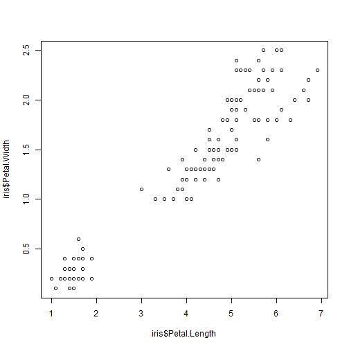

## What is R?

> * A statistical programming language.
> * Most importantly, it is:
   * Free!
   * Open Source
   * Under Constant Development

--- 

## Why Use R?

> * It is desgined with statistics and statisticians in mind
> * Provides a single platform for analysis and visualisation
> *	Massive range of visualisation options
> *	On the cutting edge/constantly updated 
> *	Range of dissemination options
> *	Shiny 


---

## Designed For Statistics

> * Basic plots are very easy to produce
> * also easily altered quickly
> * Well suited to fast, exploratory visualisation


---
## Basic Plots are easy


```r
plot(iris$Petal.Length, iris$Petal.Width)
```

 

---
## Brief aside on Flower data


---
## Basic Plots are easy

```r
hist(x)
```

 


---
## Plots easily altered

```r
x2 <- x[x < 10]
hist(x2)
```

 


---
## Plots easily altered

```r
hist(log(x))
```

 


---
## Common Statistical Tasks Are Easily Handled

> * Basic Statistical tasks are considered and easy to carry out.
    * which they may not be in other programming languages.
    
> * Major reason to consider R over alternatives like Python or Matlab.

> * Similar to SAS in this regard.


---
## Common Statistical Tasks Are Easily Handled


```r
plot(iris$Petal.Length, iris$Petal.Width)
```

 


---
## Common Statistical Tasks Are Easily Handled


```r
xyplot(Petal.Width ~ Petal.Length | Species,data = iris)
```

 


---
## Common Statistical Tasks Are Easily Handled

```r
pairs(iris[,1:4])
```

 


---
## Common Statistical Tasks Are Easily Handled

* Model Checking can be time consuming given the number of assumptions that need checked

 


---
## Common Statistical Tasks Are Easily Handled


```r
plot(regression_model)
```

 


---
##	Publication Quality Plots are Easy

> * Once a basic plot has been decided on it is easy to produce high quality versions for publication.
> * Highly customisable and available in a range of formats.


---
## Publication Quality Plots are Easy

 


---
## Publication Quality Plots are Easy

 


---
## Designed for Statistics

> *	All of the above can be done by any most other programming languages
> * But not as easily, as neatly, or as quickly


---
## An Integrated Analysis & Visualisation Platform

> * Allows you to easily move from analysis to visualisation.
> * Keeps the workflow clean and can be stored in a single file.
> * Allows for easy visualisation of complex analyses/models.
> * Easy to replicate/extend plots for new data


---
## An Integrated Analysis & Visualisation Platform

 


---
## An Integrated Analysis & Visualisation Platform


```
## This is lavaan 0.5-20
## lavaan is BETA software! Please report any bugs.
```

 


---
## An Integrated Analysis & Visualisation Platform

 


---
## Massive Range of Visualisation Options

> * 'Basic' Visualisations extremely well integrated
> * But much greater flexibility is offered than in most other software packages
> * Wide range of domain specific visualisation supported also (e.g. GIS)


---
## 'Basic' Charts

 


---
## 'Basic' Charts
 


---
## 'Basic' Charts
 


---
## Specific Subject Areas

> * R also has very strong capabilities in topic specific areas of visualisation
> * e.g. Geographical Information Systems (GIS)
>   * Again R excels here as a single analysis/visualisation environment.


---
## GIS Capabilities

 


---
## GIS Capabilities
 

---
## GIS Capabilities

* Commute Example


---
## On Cutting Edge

> * Constantly developed so new technology often encorporated
> * Has powerful support to the D3 Javascript plotting library
> * Google motion plots easily handled (if DII allowed Flash.)
> * Ever increasing number of options for interactive plotting (plot.ly went open source in November for example)

> * But just because this exists doesn't mean it always plays well with other packages. This includes slides...


---
## Range of Dissemination Options

> * Not Limited to 'copy and pasting' images into word documents
> * R can be used to produce, fully functional:
> * Word Documents
> * Web Pages
> * PDF Documents
> * and slide shows!


---
## Examples of Dissemination

> * DEA Supplementary Web Page
> * Treemap Documentation
> * These slides
> * Automatically updating report


---
## R Shiny

> * Tool for producing interactive data applications
> * Extremely Powerful and Versatile
> * Can be hosted on a web server
> * Only requires knowledge of R code
> * Also completely Free


---
## So What?

> * R is currently available on the VM
> * Introductory training in R is currently being organised by the department
> * Working group set up recently to iron out any difficulties using R in MOD and look into extending functionality.


---
## Any Questions?


